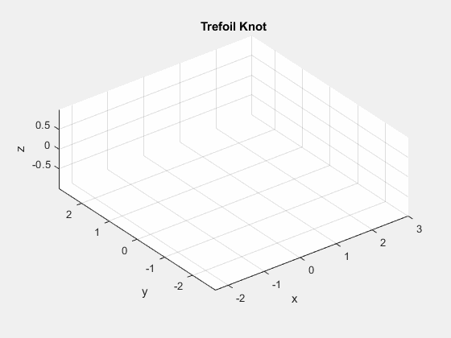
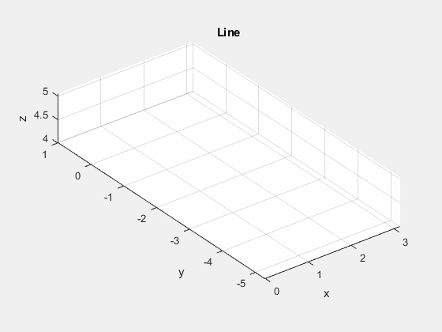
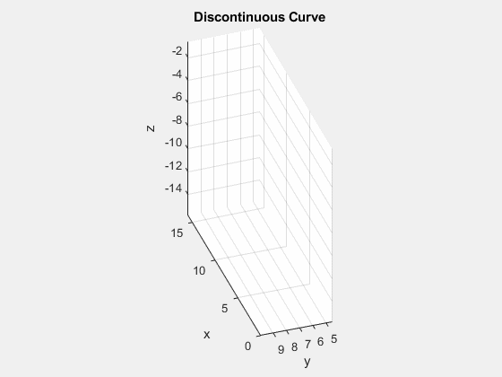
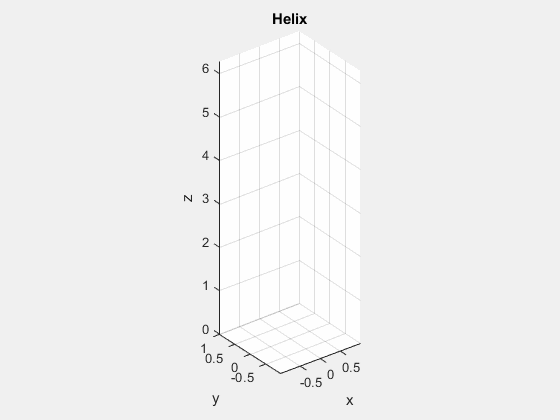
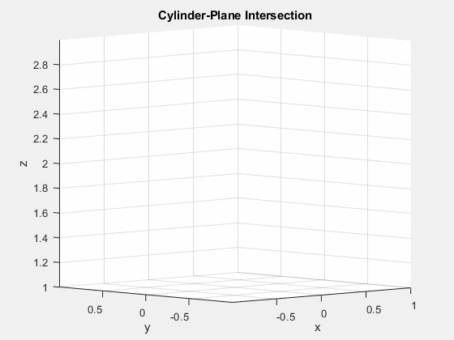
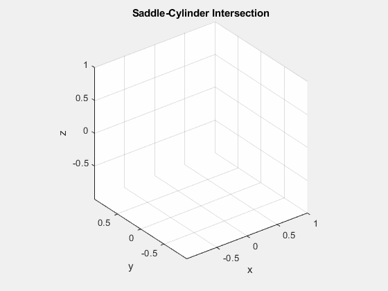

## Examples
In each example $F$ is the vector function being traced through the parameter range $t$.

### Trefoil Knot
$F(t) = \langle (2+\cos(t))\cos(t),(2+\cos(1.5t))\sin(t),\sin(1.5t)\rangle$ for $0\leq t\leq4\pi$ traces out the famous Trefoil Knot; the simplest example of a prime Knot, taking a similar role to that of Hydrogen on the periodic table of Knots.

### Line
$F(t) = \langle t,1-2t,4+\frac{t}{3} \rangle$, $0\leq t\leq 2\pi$

### A discontinuous curve
$F(t) = \langle t^4,10\frac{\sin(t)}{t},te^{-z}-1\rangle$, $-2\leq t\leq2$

### Helix
*(left)* $F(t) = \langle\sin(t),\cos(t),t\rangle$ and *(right)* $F(t)=\langle\cos(t),t,\sin(t)\rangle$, $0\leq t\leq2\pi$

  
  &nbsp; &nbsp; &nbsp; &nbsp; &nbsp; &nbsp; &nbsp; &nbsp; 
  

### Intersection of a cylinder and plane
The vector function $F(t) = \langle\cos(t),\sin(t),2-\cos(t)\rangle$ for $0\leq t\leq2\pi$ traces out the intersection of the cylinder $x^2+y^2=1$ with the plane $y=x$.

### Intersection of the saddle with the cylinder
The vector function $F(t) = \langle\cos(t),\sin(t),1-2\sin^2(t)\rangle$ for $0\leq2\pi$ traces out the intersection of the saddle $z=x^2-y^2$ and the cylinder $x^2+y^2=1$.

