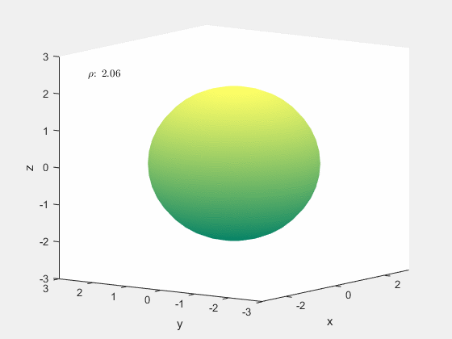

## Integration
##

### int_vis(r, u_range, v_range, delta).m

draws the surface $S$ determined by $z=f(x,y)$ and parametrized by $r(x,y)=\langle x,y,f(x,y)\rangle$ over the range specified by u_range and v_range, then draws the rectangular volumes for estimating the double integral over the surface. delta controls how many blocks are used. The height of the block is determined by evaluating the $f$ at the smallest vertex of the rectangle. 

The function expects the output of $r$ to be a 3D matrix whose layers correspond to the cartesian coordinates. The surface below is given by $z=x^2+y^2$, thus in MATLAB, $r(x,y)=@(x,y)\ \text{cat}(3,x,y,x^2+y^2);$

##

### int_visR(r, u_range, v_range, delta).m

accomplishes the same task as the above function except the height of the rectangular block is determined by evaluating $f$ at a randomly chosen point inside each subrectangle of the domain.

  
  &nbsp;
  
  &nbsp;
  

## Spherical Coordinates
##

To transition from cartesian coordinates $(x,y,z)$ to spherical coordinates $(\rho,\theta,\phi)$ one uses the formulas: $x=\rho\cos(\theta)\sin(\phi)$, $y=\rho\sin(\theta)\sin(\phi)$, and $z=\rho\cos(\phi)$.

### rhoani().m

creates an animation for constant values of $\rho$ in spherical coordinates

##

### theta().m

creates an animation for constant values of $\theta$ in spherical coordinates

##

### phiani().m

creates an animation for constant values of $\phi$ in spherical coordinates

