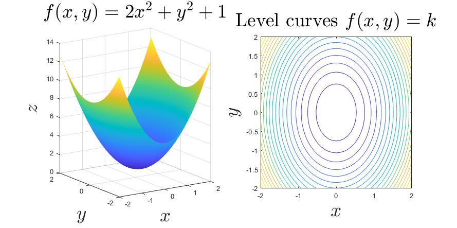
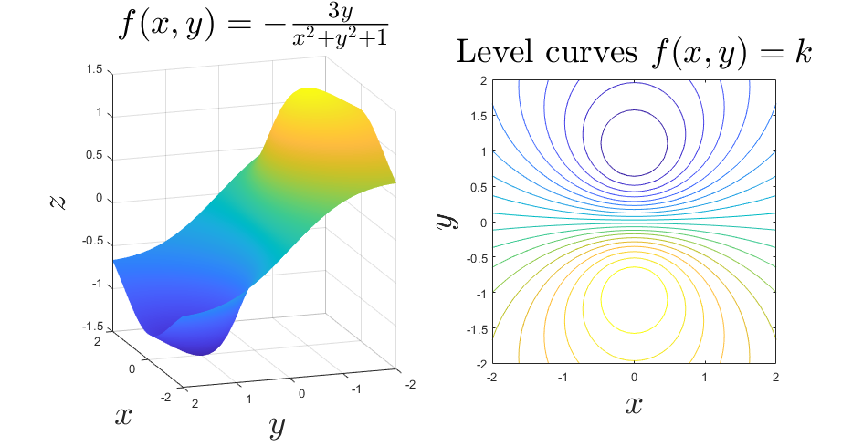
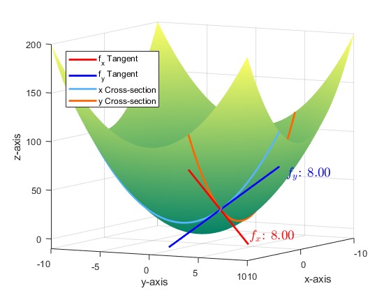
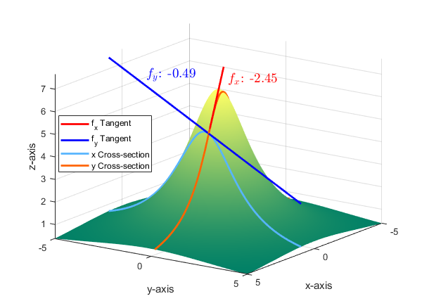

## Multivariable Functions
***
### lvlcurve(f,gridType).m,
Draws the surface defined by $z=f(x,y)$ with coordinate basis 'cart' for cartesian and 'pol' for polar. Then draws a separate contour graph showing sample level curves.

Elliptic paraboloids with axis domainted by the $y$-axis and $x$-axis respectively.

  
  &nbsp; &nbsp; &nbsp; &nbsp; &nbsp; &nbsp; &nbsp; &nbsp; 
  

##

A surface giving rise to a dipole contour graph, $f(x,y)=-3y/(x^2+y^2+1)$.

##

A surface giving rise to 4 hills near the origin, $f(x,y)=-xye^{-x^2-y^2}$

## Partial Derivatives
***

### partial_vis(f_sym,a,b,t,rng).m
***

Draws the surface defined by $f_{sym}:\mathbb{R}^2\rightarrow\mathbb{R}$, with its partial derivatives $f_x$ and $f_y$ at $(a,b)$ visualized as the slope of the tangent lines to the $y$ and $x$ cross sections respectively of the surface. Restricts the surface to the domain $D = t\times t$, where $t$ is an interval on the real line. *rng* = $[z_-,z_+]$ determines a padding for the $z$-axis. Aids understanding of what these partials derivatives really *are* and can be thought of as a simple extension of the single variable derivative as the tangent line to the curve.

An elliptic paraboloid $f(x,y)=x^2+y^2$ with its partial derivatives at $(4,4)$ visualized as tangent lines to the cross sections. Here $t=[-10,10]$ and $rng=[-10,0]$

##

A *mountain* parametrized by $f(x,y)=20/(x^2+2y^2+3)$ with partial derivatives at $(1,.2)$. In this example, $t=[-5,5]$ and $rng=[0,1]$.

### tangent_plane(f_sym,a,b,t,rng).m
***

Takes as input the same parameters as before but instead draws the tangent plane at $(a,b)$ defined as the plane containing both of the $f_x$ and $f_y$ tangent lines.

Zooming in on the point $(4,4)$ reveals that the tangent plane is a good local approximation to the paraboloid.

  
  &nbsp; &nbsp; &nbsp; &nbsp; &nbsp; &nbsp; &nbsp; &nbsp; 
  
  &nbsp; &nbsp; &nbsp; &nbsp; &nbsp; &nbsp; &nbsp; &nbsp; 
  

##

The tangent plane at the peak of the *mountain* appears to be a terrible approximation at first glance. However! If one zooms in close enough, they see that the tangent plane is still a good *local* approximation.

  
  &nbsp; &nbsp; &nbsp; &nbsp; &nbsp; &nbsp; &nbsp; &nbsp; 
  
  &nbsp; &nbsp; &nbsp; &nbsp; &nbsp; &nbsp; &nbsp; &nbsp; 
  

