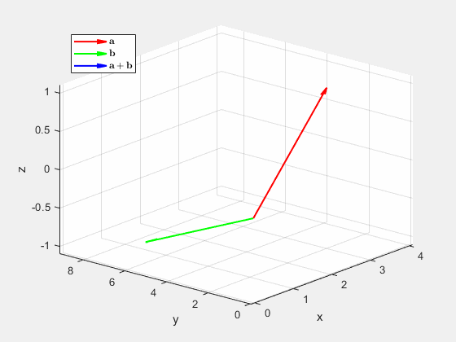
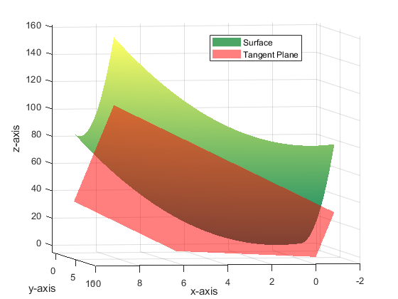
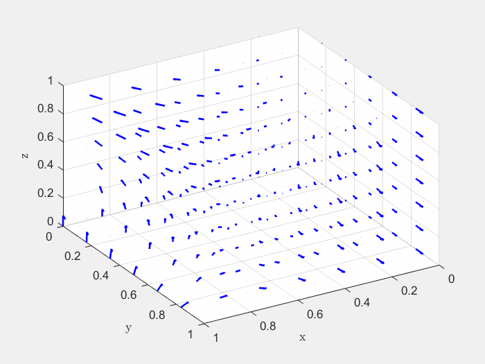
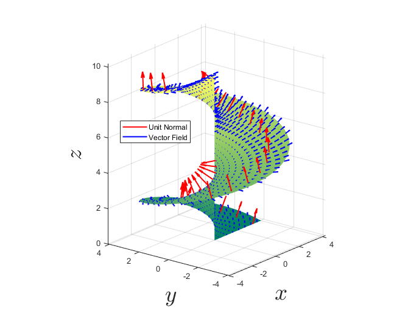

# Multivarable Calculus MATLAB
This repository was used for the Multivariable Calculus course I taught at the University of Cincinnati. The code is written in MATLAB since the university has a campus-wide license for the programming package. This also makes the demonstrations more appealing to our engineering and science students who will or are being taught to program in MATLAB in their other courses. Through this repository, they are able to revisit the visualizations seen in class and alter the code on their own. My students found my MATLAB demonstrations particularly helpful, in addition to my hand-drawn illustrations on the whiteboard - there are some things we can only indicate towards with a planar canvas.

The content I used for this class was inspired by *An Illustrative Guide to Multivariable and Vector Calculus* by Milavcic and the later chapters in the University sponsored textbook *Early Transcendentals* by Stewart. The content is organized into 5 sections:

## Vectors, Planes, Surfaces, and the Dot and Cross Product

This section is contained in the 'Vectors_Planes_Surfaces' folder, covering chapter 12 of *Early Transcendentals* and chapter 1 of *An Illustrative Guide to Multivariable Calculus*. The highlights are **(1)** visualizing vector operations and **(2)** surfaces generated by conic sections (quadric surfaces).

  
  &nbsp; &nbsp; &nbsp; &nbsp; &nbsp; &nbsp; &nbsp; &nbsp; 
  

## Space Curves, Brief Vector Calculus, Arclength and Curvature

This section is contained in the 'Space_Curves' folder, covering chapter 13 of *Early Transcendentals* and section 5.A of *An Illustrative Guide to Multivariable Calculus*. The highlights are **(1)** animations for space curves and **(2)** animating the circle of curvature and the normal and tangent vectors as the curve is traversed in time.

  
  &nbsp; &nbsp; &nbsp; &nbsp; &nbsp; &nbsp; &nbsp; &nbsp; 
  

## Functions of Several Variables, Partial Derivatives, and the Gradient

This Section is contained in the 'Partial_Derivatives' folder, covering chapter 14 of *Early Transcendentals* and chapter 2-3 of *An Illustrative Guide to Multivariable Calculus*. The highlights are
**(1)** graphing a surface with level curves simultaneously, **(2)** visualizing partial derivatives as the slope of tangent lines to cross sections of the surface, **(3)** plotting the tangent plane to a surface, and **(4)** animating the directional derivative.

  
  &nbsp; &nbsp; &nbsp; &nbsp; &nbsp; &nbsp; &nbsp; &nbsp; 
  

 

  
  &nbsp; &nbsp; &nbsp; &nbsp; &nbsp; &nbsp; &nbsp; &nbsp; 
  

## Integration

This section is contained in the 'Integration' folder, covering chapter 15 of *Early Transcendentals* and chapter 4 of *An Illustrative Guide to Multivariable Calculus*. The highlights are **(1)** visualizing multiple integration as the total volume of the *body* under the surface of $z=f(x,y)$ and **(2)** animating surfaces of constant a spherical coordinate ("spherical planes").

  
  &nbsp; &nbsp; &nbsp; &nbsp; &nbsp; &nbsp; &nbsp; &nbsp; 
  

## Vector Calculus

This section is contained in 'Vector_Calculus', covering chapter 16 of *Early Transcendentals* and chapter 5 of *An Illustrative Guide to Multivariable Calculus*. The highlights are **(1)** animating different paths taken in a vector field for line integrals and **(2)** visualizing the flux through a parametric surface.

  
  &nbsp; &nbsp; &nbsp; &nbsp; &nbsp; &nbsp; &nbsp; &nbsp; 
  

