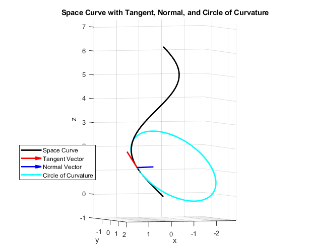
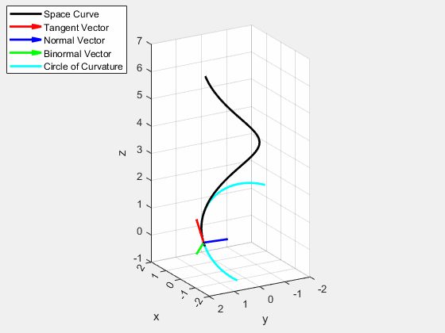
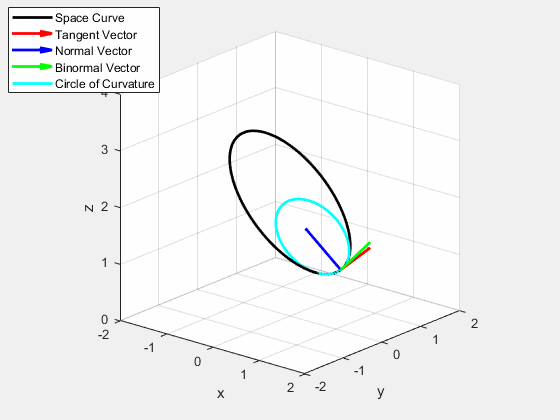
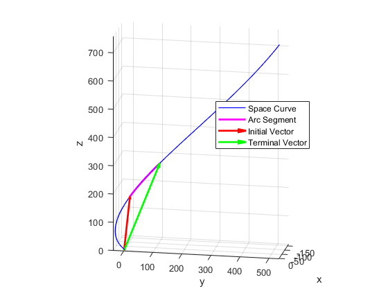
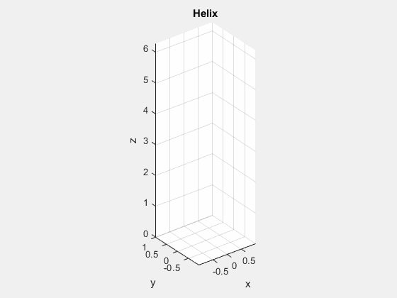
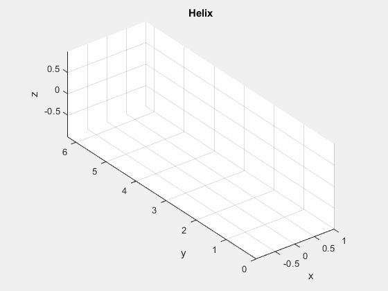
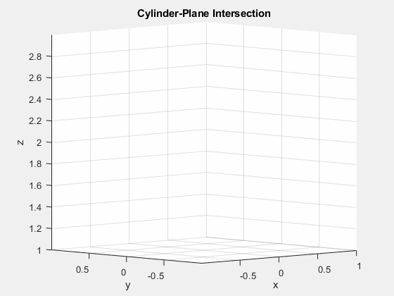
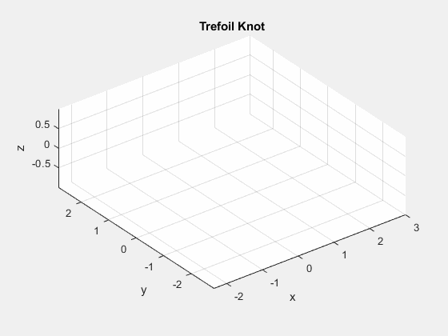

## Curvature
***

### viscurvature(f,g,h,t).m
***
Draws the spacecurve defined by $F(t)=(f(t),g(t),h(t)):\mathbb{R}^3\rightarrow\mathbb{R}$ (default $t\in[0,2\pi]$) and the normal and tangent vectors at a point $1/5$ along $t$, in addition to the circle of curvature at that point. Options to include the binormal vector, osculating plane, and normal plane.

### anicurvature(f,g,h,t).m
***
The code *anicurvature.m* takes as input the parametric equations for a vector function, then animates the circle of curvature and the tangent, normal, and binormal vectors as the curve is traversed. Optional input is the range of parameter values. When the code is finished running it produces the animation as a gif *anicurvature.gif*.

A helix about the $z$-axis.

##

The intersection of a cylinder with a plane results in the ellipse parametrized by $\mathbf{r}(t)=\langle\cos(t),\sin(t),2-\cos(t)\rangle$

 
 ##

 The intersection of a saddle with a cylinder results in the curve parametrized by $\mathbf{r}(t)=\langle\cos(t),\sin(t),1-2\sin^2(t)\rangle$

 

 ##

 The infamous **trefoil knot** can be parametrized by $\mathbf{r}(t)=\langle(2+\cos(1.5t))\cos(t),(2+cos(1.5t))\sin(t),\sin(1.5t)\rangle$

 

## Space Curves
***

### arclength(f,g,h,t1,t2).m
***
Draws a spacecurve defined by $F(t)=(f(t),g(t),h(t)):\mathbb{R}^3\rightarrow\mathbb{R}$ (default $t\in[0,2\pi]$) and the arc of the segment between the times $t_1$ and $t_2$.

### spacecurve(f,g,h,t).m
***
Animates the spacecurve defined by $F(t)=(f(t),g(t),h(t)):\mathbb{R}^3\rightarrow\mathbb{R}$ over the range specified in $t$ (default is $t=[0,2\pi]$).

Helices moving about the $z$ and $y$ axes respectively

  
  &nbsp; &nbsp; &nbsp; &nbsp; &nbsp; &nbsp; &nbsp; &nbsp; 
  

##

The vector function $F(t) = \langle\cos(t),\sin(t),2-\cos(t)\rangle$ for $0\leq t\leq2\pi$ traces out the intersection of the cylinder $x^2+y^2=1$ with the plane $y=x$.

##

The vector function $F(t) = \langle\cos(t),\sin(t),1-2\sin^2(t)\rangle$ for $0\leq t\leq2\pi$ traces out the intersection of the saddle $z=x^2-y^2$ and the cylinder $x^2+y^2=1$.

##

$F(t) = \langle (2+\cos(t))\cos(t),(2+\cos(1.5t))\sin(t),\sin(1.5t)\rangle$ for $0\leq t\leq4\pi$ traces out the famous Trefoil Knot; the simplest example of a prime Knot, taking a similar role to that of Hydrogen on the periodic table of Knots.

