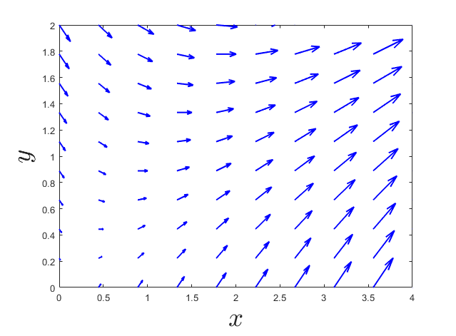
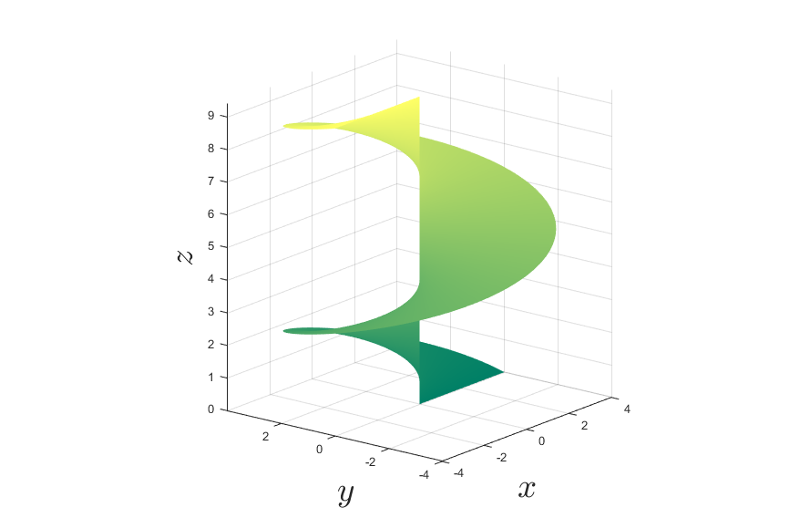
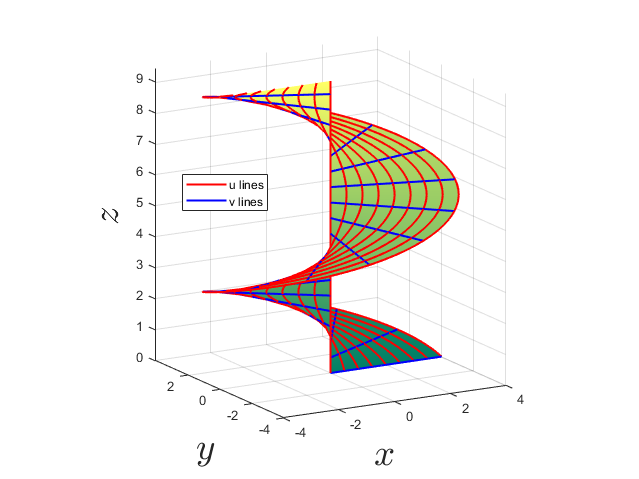

## Vector Fields
##

### planefield(f, g, range, gridDensity).m
plots the plane field defined by $F=(f(x,y),g(x,y)):\mathbb{R}^2\rightarrow\mathbb{R}^2$ over the given range with gridDensity determining the number of vectors to display in the field.

$F(x,y)=\langle x+y,y-x\rangle$, $(x,y)\in[0,4]\times[0,2]$

##

### vectorfield(f, g, h, range, gridDensity).m
plots the vector field defined by $F=(f(x,y,z),g(x,y,z),h(x,y,z)):\mathbb{R}^3\rightarrow\mathbb{R}^3$ over the given range with gridDensity determining the number of vectors to display in the field.

$F(x,y,z)=\langle xy,y^2,x^2\rangle$, $(x,y,z)\in[0,1]^3$

## Line Integrals
##

### planecurve(x_fn, y_fn, t, frame_rate).m
### planecurve2(x_fn1, y_fn1, t1, x_func2, y_func2, t2, frame_rate).m

planecurve.m animates the plane curve defined by $r(t)=\langle x(t),y(t)\rangle$ over the parameter range $t$. planecurve2.m animates two plane curves simultaneously, for when we want to compare the difference in the line integral along the distinct paths.

two plane curves in the plane field $\langle x+y,y-x\rangle$, the green curve is along $y=x^2$ and the red one is the straight line path from $(1,1)$ to $(4,2)$.

##

### spacecurve(x_fn, y_fn, z_fn, t, frame_rate).m
### spacecurve2(x_fn1, y_fn1, z_fn1, t1, x_fn2, y_fn2, z_fn3, t2, frame_rate).m

spacecurve.m animates the space curve defined by $r(t)=\langle x(t),y(t),z(t)\rangle$ over the parameter range $t$. spacecurve2.m animates two curves simultaneously, for when we want to compare the difference in the line integral along the distinct paths.

two space curves in the vector field $F(x,y,z)=\langle xy,y^2,x^2\rangle$, the red path is parametrized by $r_1(t)=\langle t,t,t^2\rangle$ and the green path by $r_2(t)=\langle t^2,t,t^2\rangle$ from $(0,0,0)$ to $(1,1,1)$

## Surface Integrals
##

### parasurf(r, u_range, v_range).m

plots the surface parametrized by $r(u,v):\mathbb{R}^2\rightarrow\mathbb{R}^3$ over the domain $D$ defined by u_range and v_range. In MATLAB, $r$ is assumed to be a function of $u$ and $v$ which outputs a 3D matrix where the first layer represents $x$-coordinates, the second layer $y$-coordinates, and the third layer $z$-coordinates.

a helicoid parametrized by $r(u,v)=\langle u\cos(v),u\sin(v),v\rangle$ over $(u,v)\in[0,4]\times[0,3\pi]$. In MATLAB, $r$ is constructed with the syntax: r = @(u,v) cat $(3,u\cos(v),u\sin(v),v)$

##

### surfdens(r, f, u_range, v_range).m

plots the surface density defined by the scalar function $f(x,y,z)$ over the surface parametrized by $r(u,v):\mathbb{R}^2\rightarrow\mathbb{R}^3$ over the domain $D$ defined by u_range and v_range.

the same helicoid as above with density function $f(x,y,z)=x+y$.

##

### surfcoord(r, u_range, v_range, p).m

plots a partition of the surface into $dS=dudv$ area elements using constant $u$ and $v$ curves to illustrate the difference between the surface integral and a regular double integral with the area element $dA=dxdy$. $p$ determines how fine the partition will be.

##

### vecsurf(r, F, u_range, v_range).m
plots the surface defined by $r$, u_range, and v_range, then displays both the orientation of the surface (as a few sample normal vectors) and the vector field $F$ on the surface.

the helicoid with vector field $F(x,y,z)=\langle z,y,x\rangle$

