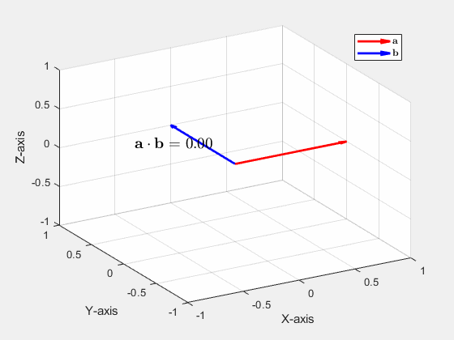

## Vectors
##

### vector_addition(vector1,vector2).m 
##
takes as input two 3D row vectors, $[a,b,c]$, whose tails are at the origin and animates the physical interpretation of their addition. Specifically, the function moves the second vector along the line from the origin to the tail of the first vector while mainting the same magnitude and direction, then the animation draws the resulting vector sum.

##

### crossani(vector1,vector2).m
animates the cross product of two vectors as the angle between them varies from $0$ to $2\pi$. The purpose is to show that the cross product is $0$ when the vectors are parallel and maximum when they are perpendicular.

##

### dotani(vector1,vector2).m
displays the value of the dot product as vector2 is rotated about vector1 along the conventional angle $\theta$. Shows that the dot product is maximal when the two vectors are parallel and minimal when they are perpendicular.

##

### pyth3d(vector1,vector2).m

draws the parallelogram formed by the two input vectors. Then also draws the projections of the parallelogram onto the coordinate planes. This function was used to illustrate the proof that the magnitude of the cross product is equal to the area of the paralleogram formed by the two vectors. Specifically, it illustrates what may be called a **3D generalization of *Pythagoras'* theorem**: The square of the yellow parallogram is equal to the sum of the squares of its three projections (the red, green, and blue ones).

## Planes
##

### planeandpoint(normal,pointOnPlane,pointOffPlane).m
draws a plane with one point not on the plane for visualizing the process of finding the shortest distance between a plane and a point

##

### skewlinesandplanes(point1,direction1,point2,direction2).m
plots two skew lines defined by the input parameters and then draws the parallel planes going through both lines. Used for demonstrating the process of computing the shortest distance between two lines.

## Surfaces
##

### conicsections('conic').m
draws a cone with a plane whose intersection is the input 'conic'. Accepts 'line','parabola','circle', or 'hyperbola' as parameters. Purpose is to remind students about the conic sections and explain to them that the forthcoming **quadric surfaces are the 3D extension of the quadratic curves** they learned in highschool and single variable calculus.

##

### hyperbolicparaboloid(a,b).m
draws a hyperbolic paraboloid $z=ax^2-by^2$ with level curves $z=-.05,.05$ in blue and red respectively.

##

### graphsurf(f).m
draws the surface $S$ defined by the equation $z=f(x,y)$ for a well-behaved function $f:\mathbb{R}^2\rightarrow\mathbb{R}$. There are options to change the domain $(x,y)\in D$ in the code. Below I have drawn an elliptic paraboloid $f(x,y)=2x^2+y^2+1$ and the infamous *monkey saddle* $f(x,y)=x^3-3xy^2$.

  
  &nbsp; &nbsp; &nbsp; &nbsp; &nbsp; &nbsp; &nbsp; &nbsp; 
  

