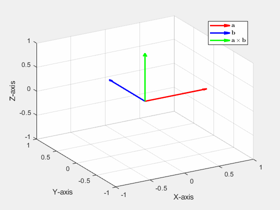

## Vectors

### vector_addition(vector1,vector2).m 
takes as input two 3D row vectors, $[a,b,c]$, whose tails are at the origin and animates the physical interpretation of their addition. Specifically, the function moves the second vector along the line from the origin to the tail of the first vector while mainting the same magnitude and direction, then the animation draws the resulting vector sum.

### crossani.m
animates the cross product of two vectors as the angle between them varies from $0$ to $2\pi$. The purpose is to show that the cross product is $0$ when the vectors are parallel and maximum when they are perpendicular.

### pyth3d(vector1,vector2).m

draws the parallelogram formed by the two input vectors. Then also draws the projections of the parallelogram onto the coordinate planes. This function was used to illustrate the proof that the magnitude of the cross product is equal to the area of the paralleogram formed by the two vectors. Specifically, it illustrates what may be called a **3D generalization of *Pythagoras'* theorem**: The square of the yellow parallogram is equal to the sum of the squares of its three projections (the red, green, and blue ones).

## Planes

## Surfaces
